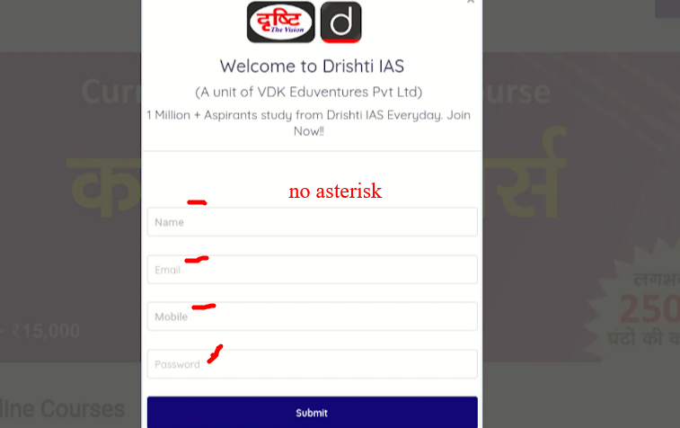

## 🐞 Bug Report — All required fields are not marked with asterisk (*) on Registration Page

**Project:** Drishti Learing App  
**Module:** Registration Page    
**Test Case ID:** TC_002  
**Reported By:** Rayean Mahmud Arnob  
**Date:** 07-Nov-2025

  

---

## Test Environment
| Component | Details |
|----------|---------|
| **OS** | Windows 10 |
| **Browsers Tested** | Firefox (Version 144.0.2 (64-bit) |
| **Device** |Laptop - HP Pavilion 15-cs2101TX, 1920×1080 resolution |
| **Network** | Stable Wi-Fi |
| **Environment** | Production |

---

## Bug Summary

 All required fields are not marked with asterisk (*) on the Registration Page
 
---

## Preconditions
- Navigate to the registration page.

---

## Steps to Reproduce
1. Navigate to the registration page  
2. Analyse the sign-up form
3. keep all the field blank
4. Click the submit button

---

## Expected Result
All required fields on the Registration Page must be marked with an asterisk (*). If any required field is missing the asterisk, a frontend validation message should appear stating: 'All fields are mandatory.

---

## Actual Result
All required fields are not marked with asterisk (*) on the Registration Page and no frontend validation message has been appeared

---

## Severity
**Medium**

---

## Priority
**Medium**

---

## Attachments

---
