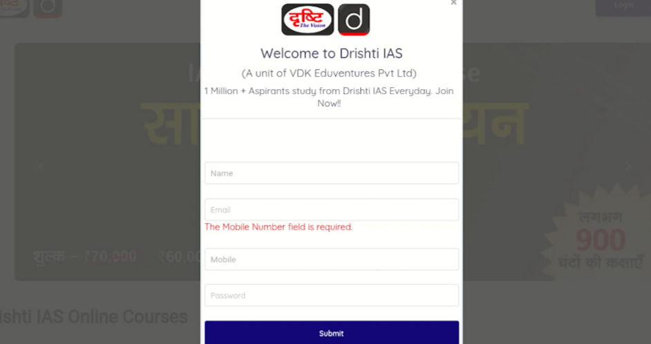

# 🐞 Bug Report — Front=end Validation Error Message are not showing appropriately on Registration Page

**Project:** Drishti Learing App  
**Module:** Registration Page    
**Test Case ID:** TC_003  
**Reported By:** Rayean Mahmud Arnob  
**Date:** 03-Dec-2025

  

---

## Test Environment
| Component | Details |
|----------|---------|
| **OS** | Windows 10 |
| **Browsers Tested** | Firefox (Version 144.0.2 (64-bit) |
| **Device** |Laptop - HP Pavilion 15-cs2101TX, 1920×1080 resolution |
| **Network** | Stable Wi-Fi |
| **Environment** | Production |

---

## Bug Summary
The **Front-end error message are not visible** below Name, Mobile and Password when user tries to register by only entering email address.
---

## Preconditions
- Navigate to the registration page.

---

## Steps to Reproduce
1. Navigate to the registration page  
2. Enter valid email and keep other field blank  
3. Click on the submit button

---

## Expected Result
Frontend validation message that Name, Mobile and password are required fields below respective fields.

---

## Actual Result
Validation error message shown only for mobile field below email field

---

## Severity
**High**

---

## Priority
**High**

---

## Attachments

---
